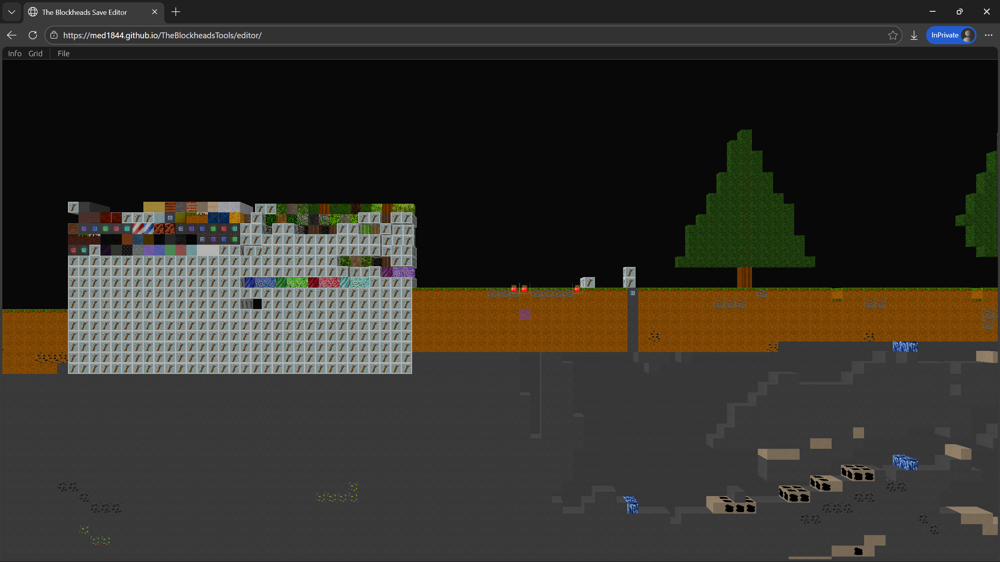
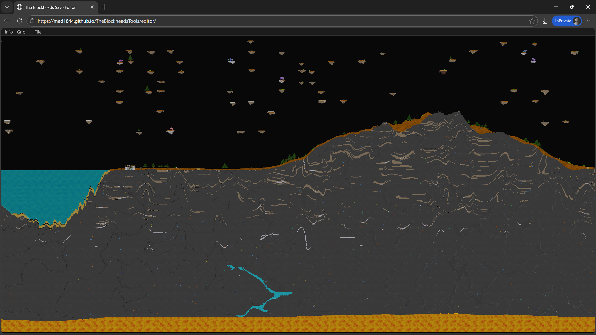
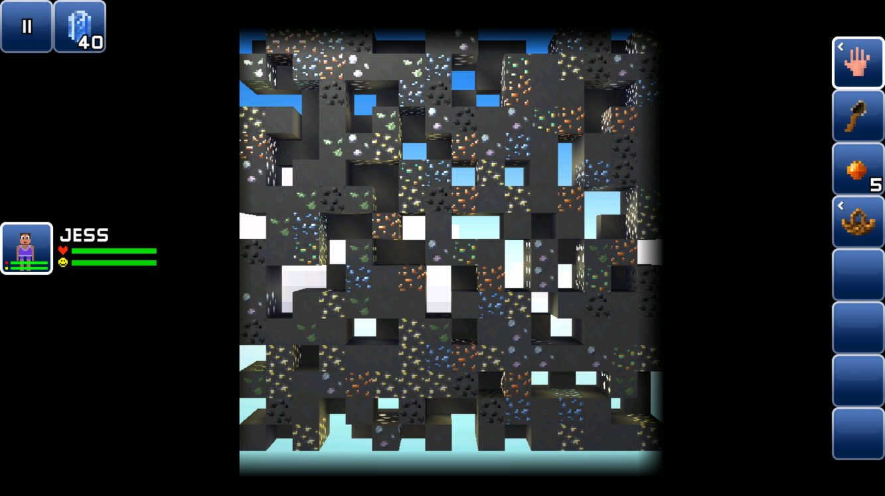
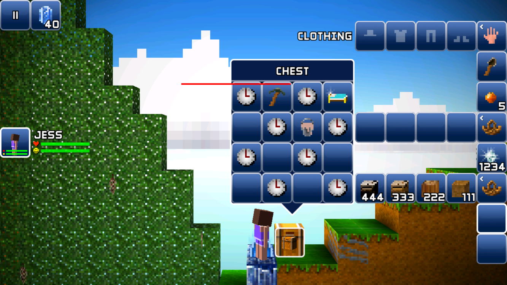

# The Blockheads Tools

A toolkit for viewing and editing save files for the mobile game *The Blockheads*.

While we don't fully understand every detail of the game save format yet, this toolkit provides a robust and growing set of tools to explore and cautiously modify your worlds.

## What You Can Do

> [!NOTE]
> There are no pre-built releases yet. To use these tools, you will need to compile them yourself. This requires having the Rust toolchain and `uv` installed.

- Explore your game world dynamically using a highly efficient 3D viewer (available for desktop and web).

  
  

- Use Python scripts to automate tasks such as modifying blocks, giving items, or changing blockhead inventories.

  
  

Check out [docs](https://med1844.github.io/TheBlockheadsTools/docs/) for installation instructions, API usage, guides, and Python examples.

## Roadmap / TODOs

- [ ] MVP of modifing blocks & saving
  MVP: ui exposing drop menu for block type
- [ ] Dynamic world editing UI
- [ ] Ergonomic block editing

## For Contributors

If you're interested in how the tools are built or want to jump in and contribute, here is a breakdown of the workspace components:

- `crates/lib`: The core Rust library for parsing and manipulating game data.
- `crates/gui`: The desktop 3D world viewer and editor, powered by `eframe`.
- `crates/web_gui`: The WebAssembly (WASM) version of the GUI crate, allowing the viewer to be used directly in a web browser.
- `crates/py_bindings`: Python bindings with type stubs, bridging the Rust core to Python for ease of scripting.
- `crates/lmdb_rs`: A custom LMDB parser and builder specifically built to handle the game's underlying databases seamlessly.
  - **Goal**: Safely read and build both 32-bit and 64-bit databases natively.
  - **Non-Goal**: Feature-complete LMDB implementation. It does not support concurrent reading/writing or random writes.
- `crates/chunk_gen`: A standalone binary for chunk generation (check its directory for more specific details).

*Note: The Python examples in the `docs/` folder has real source files in `crates/py_bindings/examples/`, and are type-checked with `prek` using github workflow to guarantee accuracy.*
