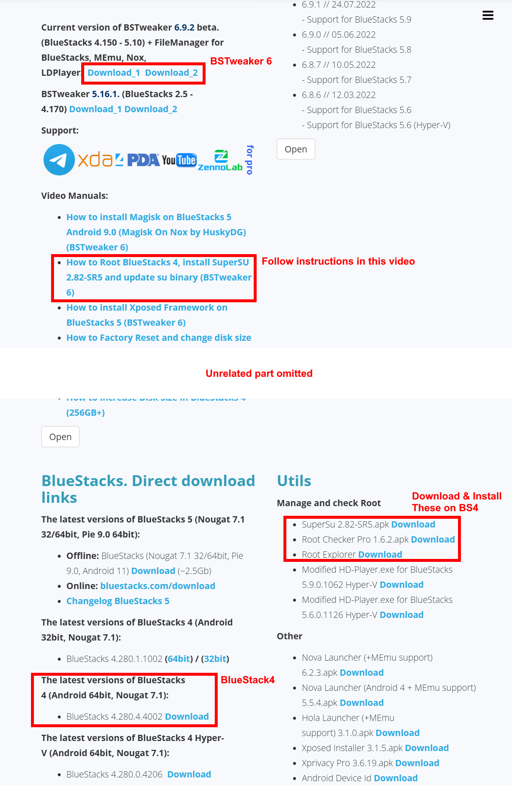
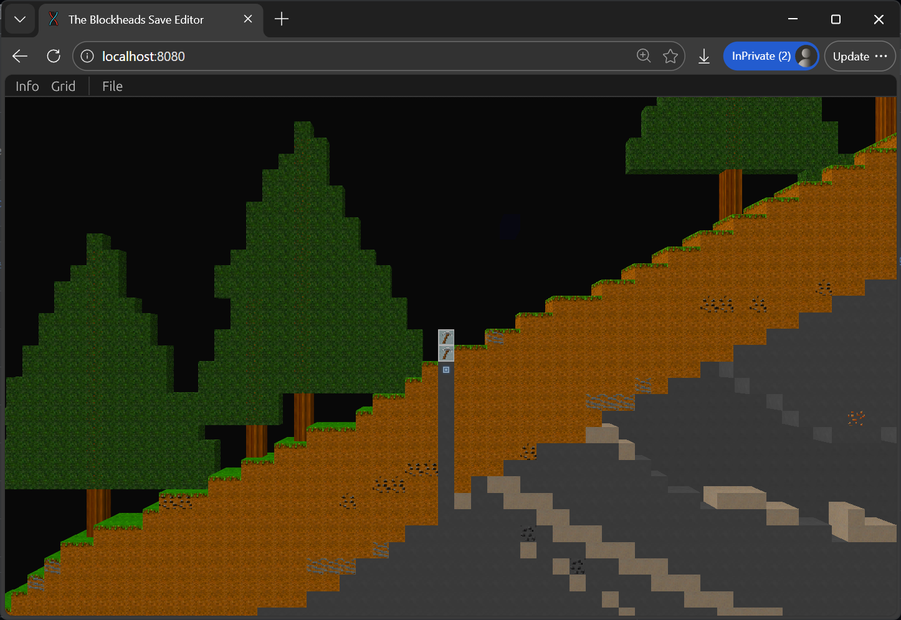

WIP. Library for reading & writing the save file of "The Blockheads", in Rust and Python.

There's a half-baked GUI that can be used to view the world.

### `libdispatch` to run server

In Ubuntu 24.04 there's no longer libdispatch in system. Manually download and install from these addresses

- [`libdispatch`](https://launchpad.net/ubuntu/zesty/amd64/libdispatch0/0~svn197-3.3ubuntu2)
- [`libdispatch-dev`](https://launchpad.net/ubuntu/focal/amd64/libdispatch-dev/0~svn197-3.3ubuntu2)

### Capturing server packets

```bash
sudo tcpdump -i any -w test.pcap port 15151
```

### TODOs

- [ ] MVP of modifing blocks & saving
  MVP: ui exposing drop menu for block type
- [ ] Dynamic world editing UI

## Set Up Android Emulator

The goal is to have a emulator that satisfies the following properties:

1. Can be rooted - so that we can access save file located in the restricted `/data/data/` directory.
2. Can run the game - the blockheads is picky about android version (<=9) AND the instruction set, as the APK only supports the armeabi-v7a ABI.
3. Can read from and write into the rooted device storage across emulator boundary, i.e. tool running on PC can read & write save files.

Fortunately, bluestacks 4 ticks all checks with the help of BSTweaker!

### Download & root emulator

First, Go BSTweaker [official website](https://www.bstweaker.ru/). If you can't open it, try internet archive [wayback machine](https://web.archive.org/web/20260000000000*/www.bstweaker.ru).

Then follow instructions to download needed softwares and follow video tutorial as instructed in this screenshot:



The Root Checker should show "device has root access" after this step is done.

### Quickly transfer worlds

Using Root Explorer, navigate to `/data/data/com.noodlecake.blockheads/files/Library/Application Support/saves` on the left side and `/storage/emulated/0/windows/BstSharedFolder` on the right side:


Manually copy the save file to windows folder, and you will be able to access it on windows in `Your BS4 installation path\BlueStacks_bgp64_hyperv\Engine\UserData\SharedFolder`.




