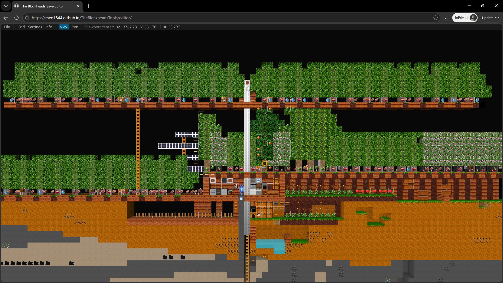
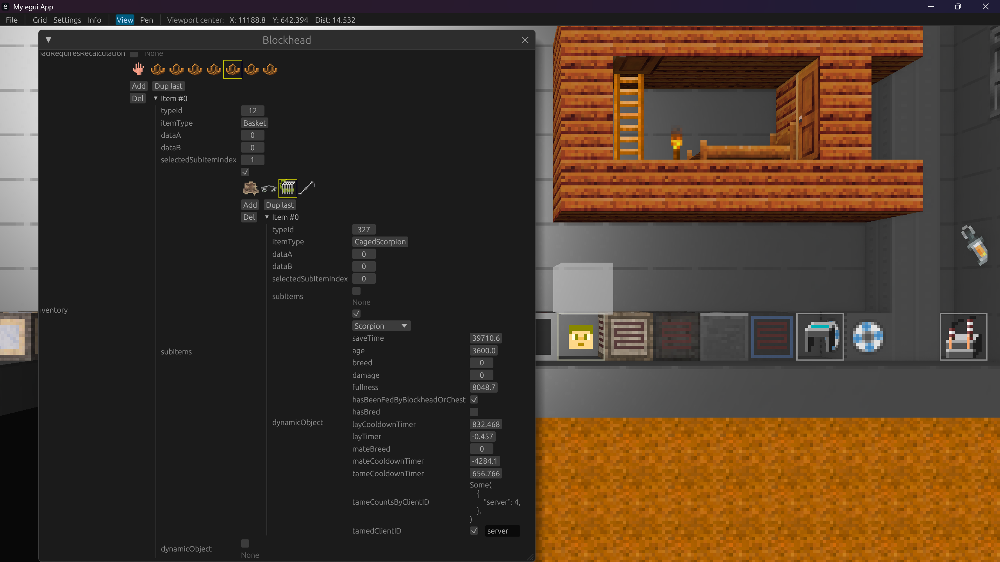
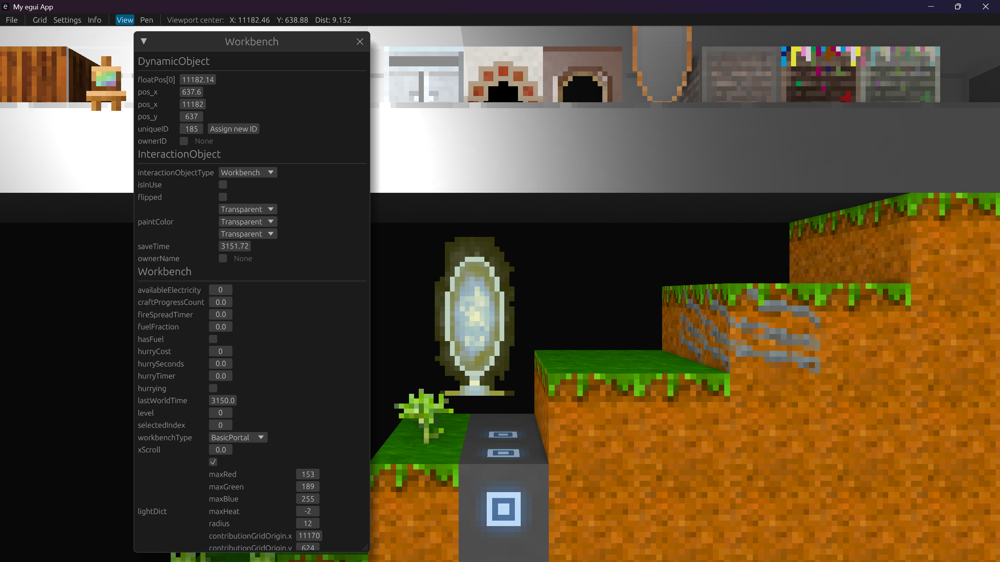
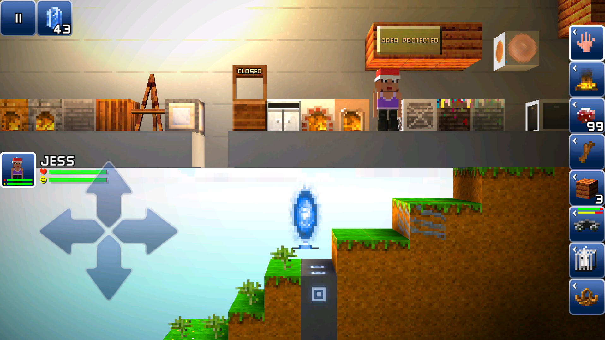
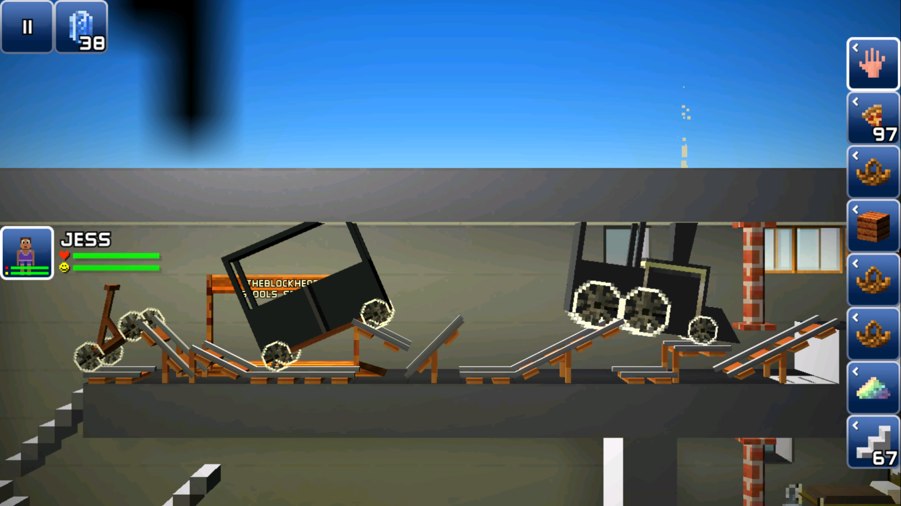
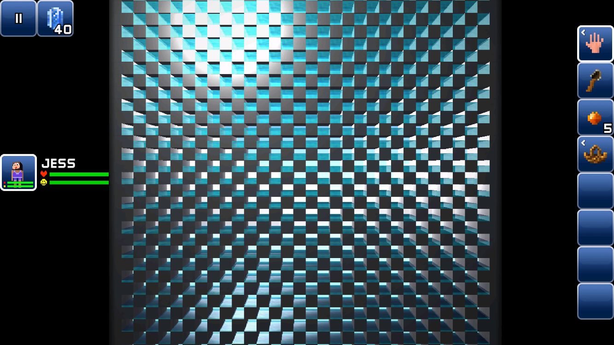

# The Blockheads Tools

A toolkit for viewing and editing save files for the mobile game *The Blockheads*.

> [!WARNING]
> The tools are experimental as we don't fully understand every detail of the game save format yet. Always back up your save files and use the tools at your own risk.

## What You Can Do

### GUI Editor

- View your game world on desktop or web:

  

  

- Edit block:

  

- Edit dynamic objects:

  - Edit blockhead inventory:

    

  - Edit dynamic object properties:

    

    

    

### Python binding

> [!NOTE]
> There are no pre-built releases for python bindings yet. To use python binding, you will need to compile them yourself. This requires having the Rust toolchain and `uv` installed.

- Use Python scripts to edit the save files in a more automated fashion, e.g. bulk modifying blocks. You can also edit blockhead inventories and chest slots.

  

  

  

Check out [docs](https://med1844.github.io/TheBlockheadsTools/docs/) for installation instructions, tutorials, examples, and guides.

## Roadmap / TODOs

- [x] Understand all dynamic objects, container types, workbench types
- [ ] Understand world generation algo & tree density algo
- [x] Refactor to use SNAFU
- [x] MVP of modifing blocks & saving
- [x] MVP: ui exposing drop menu for block type
- [ ] Ergonomic block editing
  - [x] Pen mode
  - [ ] Rect mode
- [x] Dynamic world editing UI
- [ ] python bindings

## For Contributors

If you're interested in how the tools are built or want to learn more about the save file format, here is a breakdown of the workspace components:

- `crates/lib`: The core Rust library for parsing the game save files.
- `crates/gui`: The 3D world viewer and editor, powered by `eframe`.
- `crates/web_gui`: The WASM version of the GUI crate, allowing the viewer to run in a web browser.
- `crates/py_bindings`: Python bindings with type stubs. Great for writing scripts.
- `crates/lmdb_rs`: A vibe-coded custom LMDB parser and builder specifically built to handle the databases in the save files.
  - **Goal**: Parse and build both 32-bit and 64-bit databases natively.
  - **Non-Goal**: Feature-complete LMDB implementation. It does not support concurrent reading/writing or random writes.
- `crates/chunk_gen`: A standalone binary for generate all chunks of a world on a server by fabricating chunk requests.

The Python examples in the docs has real source files in `crates/py_bindings/examples/`, and are type-checked with `ty` and are actually executed by github workflow to get output, which helps enforcing the docs to always be up-to-date.

> [!WARNING]
> The codebase is highly unstable and we recommend you avoid creating PRs for now as the code can get obsolete quickly.
