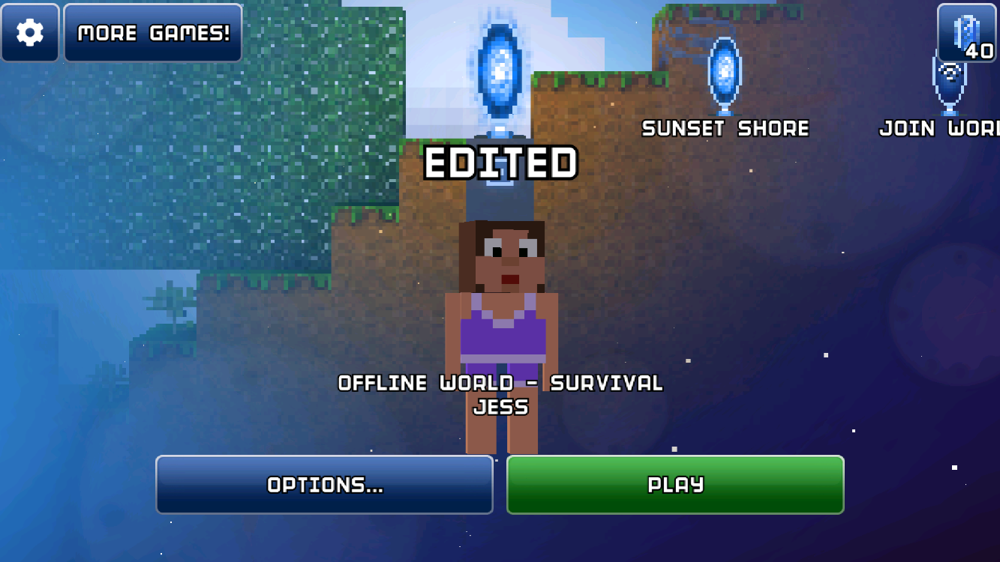

# First steps

This page covers basic usages: how to load & save world, how to edit chunks & blocks, how to edit inventories.

## Read and save the world

```python
--8<-- "world_db_io.py:open_save"
```

### Print out world information

```python
--8<-- "world_db_io.py:world_info"
```

Run it, you should see something similar to this:

```
--8<-- "main.log:world_info_output"
```

## Save the world

Say you have made some changes to the world and you are happy about it. You can save it with `WorldDb.save_path` or `WorldDb.save_bytes`.

```python
--8<-- "world_db_io.py:write_save"
```



## Read chunks and blocks

```python
--8<-- "chunk_block.py:read_chunk"
```

You should see something similar to this:

```
--8<-- "main.log:read_chunk_output"
```

## Edit chunks and blocks

!!! note
    `Chunk` instances are copies of the db data. You must use `set_chunk_at` to apply your changes back to the `WorldDb`.

```python
--8<-- "chunk_block.py:write_chunk"
```


