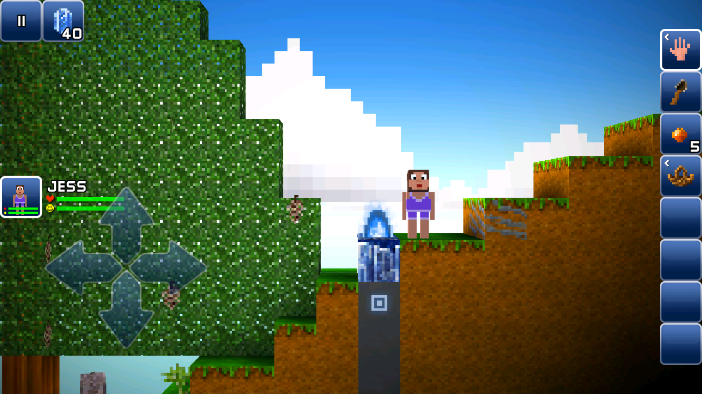
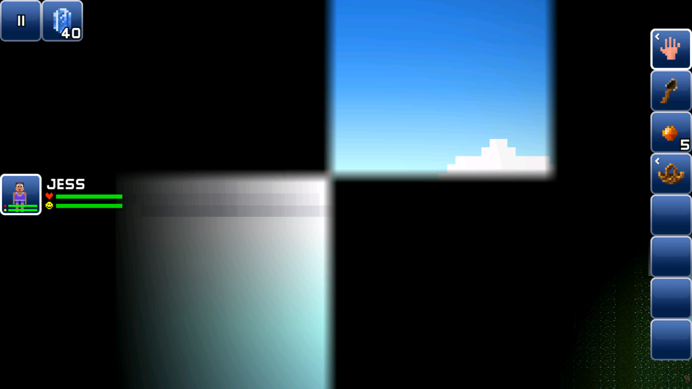
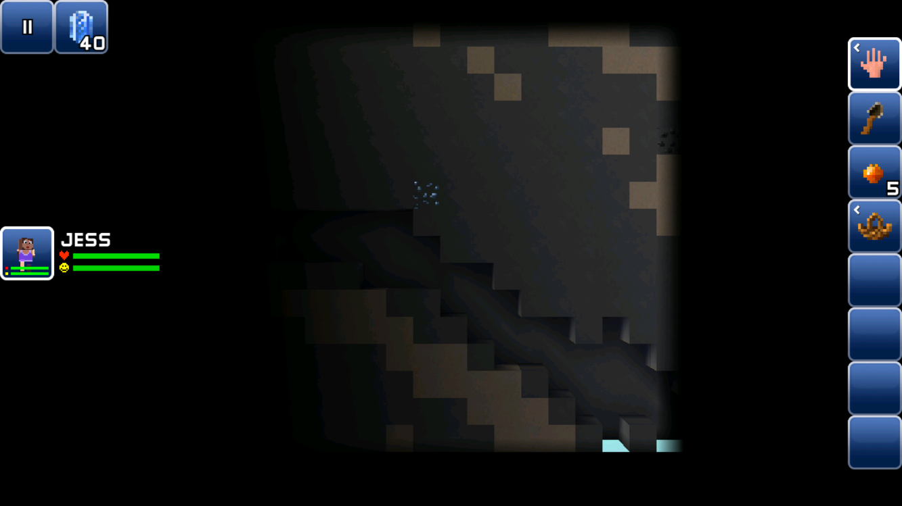
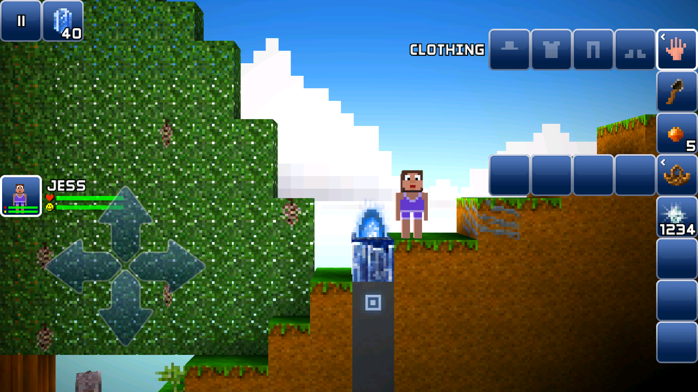
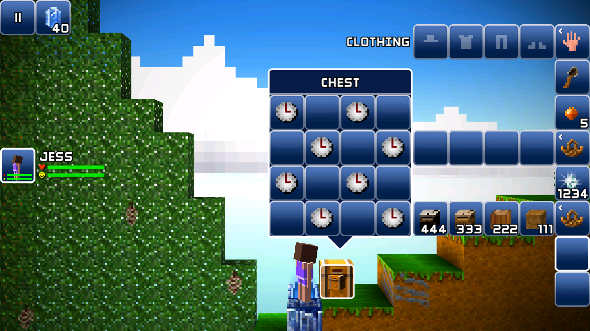

# First steps

This page covers basic usages: how to load & save world, how to edit chunks & blocks, how to edit inventories.

## World management

### Read the world

```python
--8<-- "world_db_io.py:open_save"
```

### Print out world information

```python
--8<-- "world_db_io.py:world_info"
```

Run it, you should see something similar to this:

```
--8<-- "main.log:world_info_output"
```

### Save the world

Say you have made some changes to the world and you are happy about it. You can save it with `WorldDb.save_path` or `WorldDb.save_bytes`.

```python
--8<-- "world_db_io.py:write_save"
```


## Chunk & block manipulation

### Read chunks and blocks

```python
--8<-- "chunk_block.py:read_chunk"
```

You should see something similar to this:

```
--8<-- "main.log:read_chunk_output"
```

### Edit chunks and blocks

#### Basic

!!! note
    `Chunk` instances are copies of the db data. You must use `set_chunk_at` to apply your changes back to the `WorldDb`.

    ??? note "Internal details"
        The `WorldDb` and `Chunks` instance holds a reference to data owned in Rust memory. However `Chunk` holds data owned in Python memory.

        This means, edit to the `Chunk` instance won't automatically reflect in `Chunks` - because the ownership is different.

        The following snippet tests the identities of objects:

        ```python
        --8<-- "chunk_block.py:chunk_ownership"
        ```

```python
--8<-- "chunk_block.py:write_chunk_basic"
```



#### Visibility

When your blockheads travel around the world, they will reveal blocks hidden behind the black fog. In this library, we name it "visibility". By setting their value to 255, we get a clear view.

```python
--8<-- "chunk_block.py:write_chunk_visibility"
```



#### Brightness

Even for blocks not in the black fog, they still can't be seen because they don't receive any light. This is described by "brightness".

```python
--8<-- "chunk_block.py:write_chunk_brightness"
```



#### Foreground, background, content

As you might have noticed, in the game, the world has 3 blocks in depth. We describe them as foreground, background, and content.

While foreground and background are straightforward to understand (grass, dirt, water, stone, lava, etc), the content type is more messy as it describes everything: ores, tree blocks, workbenches and their sprites, etc.

Here's an example of manually building a small 16x16 region filled with ores:

```python
--8<-- "chunk_block.py:write_chunk_fg_bg_content"
```


#### Height of water and snow

We will use water height as example here, but the same field works for snow as well.

```python
--8<-- "chunk_block.py:write_chunk_water_snow_height"
```


## Inventory manipulation

### Read blockhead's inventory

```python
--8<-- "inventory.py:read_blockhead"
```

Output:

```
--8<-- "main.log:read_blockhead_output"
```

### Edit inventory

#### Basic

You can set item type and number of items:

```python
--8<-- "inventory.py:edit_inventory_basic"
```

!!! note
    Similar to `Chunk`, `Inventory` instances are copies of the db data. You must write it back to apply your changes.



#### Containers

Blockheads can carry containers, such as basket and chests, in their inventories.

```python
--8<-- "inventory.py:edit_inventory_container"
```



#### Tool damage, dye

```python
--8<-- "inventory.py:edit_inventory_damage_dye"
```


If you want the damage indication bar to look normal, consider limit the damage value below 16384.

#### Workbench

Todo

